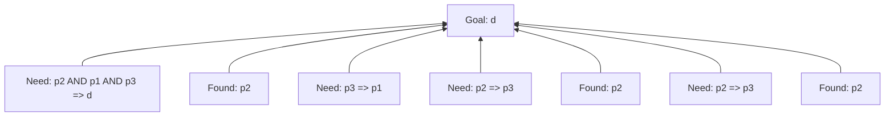

# Backward Chaining Visualization

Generated: 2024-11-21 19:48:29

## Knowledge Base
```
TELL
p2=> p3; p3 => p1; c => e; b&e => f; f&g => h; p2&p1&p3 =>d; p1&p3 => c; a; b; p2;

ASK
d
```

## Inference Process



### Reasoning Chain

**Step 1:**
- Attempting to prove: p2 AND p1 AND p3 => d

**Step 2:**
- Found fact: p2

**Step 3:**
- Attempting to prove: p3 => p1

**Step 4:**
- Attempting to prove: p2 => p3

**Step 5:**
- Found fact: p2

**Step 6:**
- Attempting to prove: p2 => p3

**Step 7:**
- Found fact: p2