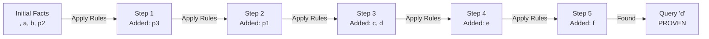

# Forward Chaining Visualization

Generated: 2024-11-21 19:52:08

## Knowledge Base
```
TELL
p2=> p3; p3 => p1; c => e; b&e => f; f&g => h; p2&p1&p3 =>d; p1&p3 => c; a; b; p2;

ASK
d
```

## Inference Process



### Step-by-Step Explanation

**Step 1:**
- Previous facts: , a, b, p2
- New facts derived: p3

**Step 2:**
- Previous facts: , a, b, p2, p3
- New facts derived: p1

**Step 3:**
- Previous facts: , a, b, p1, p2, p3
- New facts derived: c, d

**Step 4:**
- Previous facts: , a, b, c, d, p1, p2, p3
- New facts derived: e

**Step 5:**
- Previous facts: , a, b, c, d, e, p1, p2, p3
- New facts derived: f