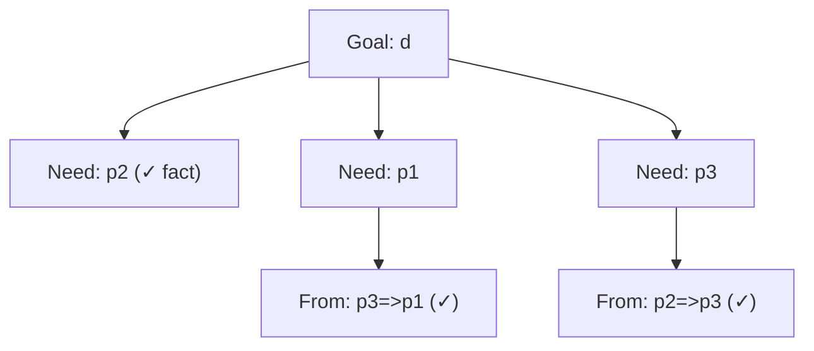

```mermaid
graph TD
    D4["Goal: d"] --> P24["Need: p2 (✓ fact)"]
    D4 --> P14["Need: p1"]
    D4 --> P34["Need: p3"]
    P14 --> P34_2["From: p3=>p1 (✓)"]
    P34 --> P24_2["From: p2=>p3 (✓)"]
```
