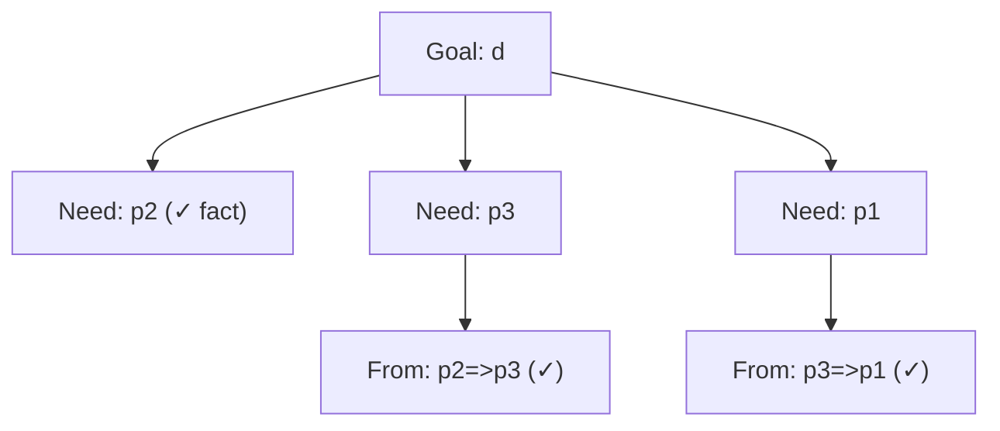

```mermaid
graph TD
    D3["Goal: d"] --> P23["Need: p2 (✓ fact)"]
    D3 --> P33["Need: p3"]
    D3 --> P13["Need: p1"]
    P33 --> P23_2["From: p2=>p3 (✓)"]
    P13 --> P33_2["From: p3=>p1 (✓)"]
```
