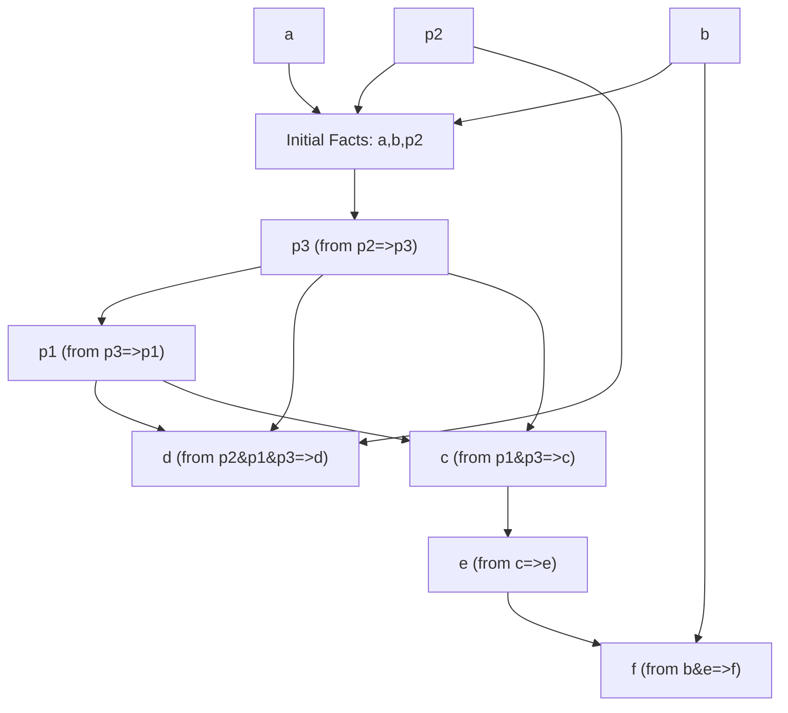

```mermaid
graph TD
    A2[a] --> Start2[Initial Facts: a,b,p2]
    B2[b] --> Start2
    P22[p2] --> Start2
    Start2 --> P32["p3 (from p2=>p3)"]
    P32 --> P12["p1 (from p3=>p1)"]
    P22 & P12 & P32 --> D2["d (from p2&p1&p3=>d)"]
    P12 & P32 --> C2["c (from p1&p3=>c)"]
    C2 --> E2["e (from c=>e)"]
    B2 & E2 --> F2["f (from b&e=>f)"]
```
