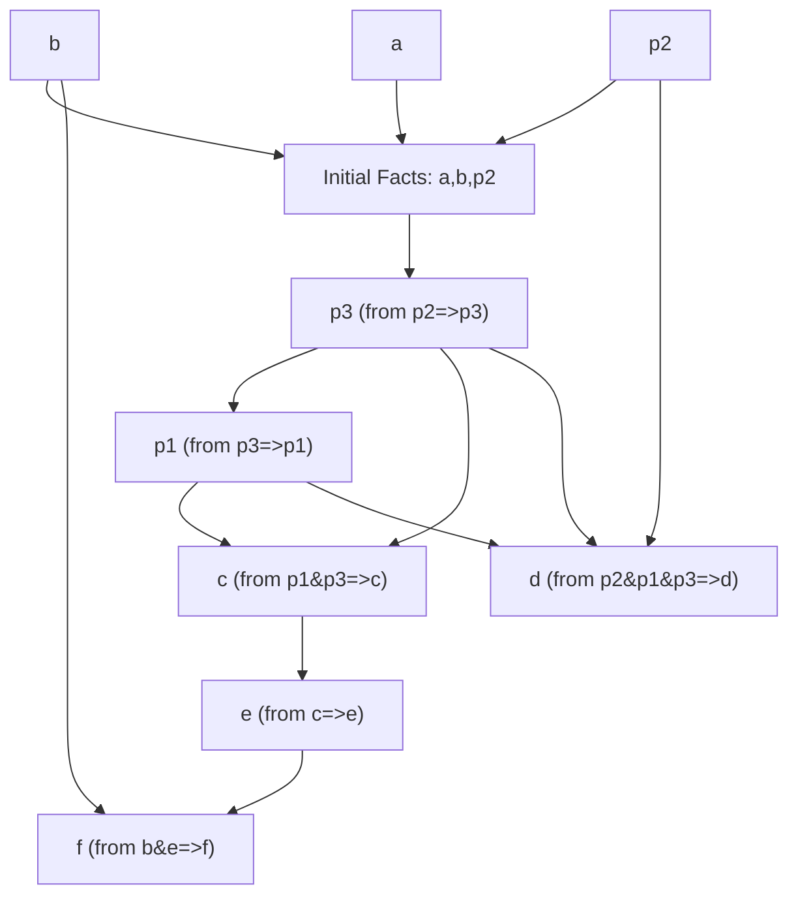

```mermaid
graph TD
    A1[a] --> Start1[Initial Facts: a,b,p2]
    B1[b] --> Start1
    P21[p2] --> Start1
    Start1 --> P31["p3 (from p2=>p3)"]
    P31 --> P11["p1 (from p3=>p1)"]
    P11 & P31 --> C1["c (from p1&p3=>c)"]
    C1 --> E1["e (from c=>e)"]
    B1 & E1 --> F1["f (from b&e=>f)"]
    P21 & P11 & P31 --> D1["d (from p2&p1&p3=>d)"]

```
