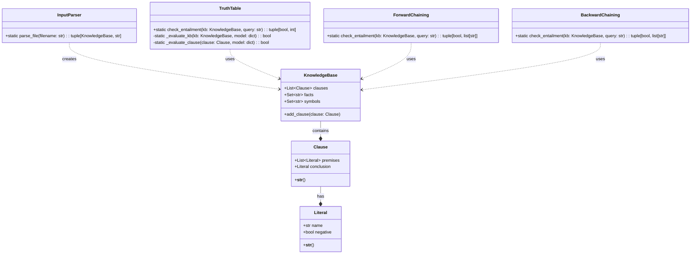

```mermaid
classDiagram
    class KnowledgeBase {
        +List~Clause~ clauses
        +Set~str~ facts
        +Set~str~ symbols
        +add_clause(clause: Clause)
    }

    class Clause {
        +List~Literal~ premises
        +Literal conclusion
        +__str__()
    }

    class Literal {
        +str name
        +bool negative
        +__str__()
    }

    class InputParser {
        +static parse_file(filename: str) : tuple[KnowledgeBase, str]
    }

    class TruthTable {
        +static check_entailment(kb: KnowledgeBase, query: str) : tuple[bool, int]
        -static _evaluate_kb(kb: KnowledgeBase, model: dict) : bool
        -static _evaluate_clause(clause: Clause, model: dict) : bool
    }

    class ForwardChaining {
        +static check_entailment(kb: KnowledgeBase, query: str) : tuple[bool, list[str]]
    }

    class BackwardChaining {
        +static check_entailment(kb: KnowledgeBase, query: str) : tuple[bool, list[str]]
    }

    KnowledgeBase --* Clause : contains
    Clause --* Literal : has
    InputParser ..> KnowledgeBase : creates
    TruthTable ..> KnowledgeBase : uses
    ForwardChaining ..> KnowledgeBase : uses
    BackwardChaining ..> KnowledgeBase : uses
```
